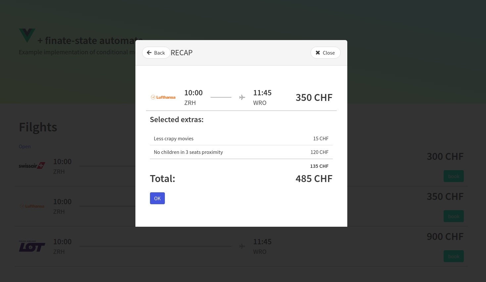

# Multi-step UI example implementation

This example implementation of conditional multi-step UI using [Vue.js](https://github.com/vuejs/vue), [Vuex](https://github.com/vuejs/vuex) and [finite-state machine](https://en.wikipedia.org/wiki/Finite-state_machine) ([machina.js](https://github.com/ifandelse/machina.js) implementation)

## Running

`npm run serve`